# Weighted Prompt Multi-Agent Router

[](https://opensource.org/licenses/MIT)
[](https://github.com/dongju2-lee/weighted-prompt-multi-agent-router)
[](https://github.com/dongju2-lee/weighted-prompt-multi-agent-router)

> **🚀 ANNOUNCEMENT:** Real-world test results and performance benchmarks will be published soon!  
> **📅 Research Publication Date:** June 26, 2025  
> **👨‍💻 Lead Researcher:** [@dongju2-lee](https://github.com/dongju2-lee)  
> **🔬 Research Status:** Ongoing - Test results and implementations are continuously updated

[한국어 README](./README_KOR.md) | [English README](./README.md)

## 🎯 Abstract

The Weighted Prompt Multi-Agent Router is an innovative system that **injects data-driven routing ratios directly into prompts to assist supervisor agent routing decisions**.

While traditional multi-agent systems require comprehensive agent descriptions in supervisor prompts, our system provides statistical ratios extracted from historical routing data along with simple agent roles. This dramatically reduces token usage while enabling data-driven accurate routing. Furthermore, simple weight parameter adjustments allow immediate implementation of real-time A/B testing, new agent deployment, and deprecated agent removal without system restarts, maximizing operational flexibility in production environments. The benefits become particularly pronounced in large-scale multi-agent environments with 100+ agents.

**Core Innovations:**
- 📊 **Data-Driven Ratio Calculation**: Extract agent-specific routing ratios from historical patterns in vector databases
- 🎯 **Prompt Enhancement**: Direct injection of calculated ratios into supervisor agent prompts as routing hints  
- ⚡ **Instant Control**: Real-time routing ratio changes and immediate system behavior control through weight adjustments alone

This approach enables accurate routing and flexible control while maintaining token efficiency in large-scale multi-agent systems.

## 💡 Motivation

### The Problem with Traditional Multi-Agent Routing

Traditional multi-agent systems face significant challenges as they scale:

1. **Token Inefficiency**: Systems with 100+ agents require enormous prompts containing all agent descriptions
2. **Cost Explosion**: Wrong agent selection in large systems leads to substantial computational waste  
3. **Limited A/B Testing**: Real-time agent deployment requires system restarts and prompt modifications
4. **Deprecation Management**: Removing agents from production requires complex system changes

### Our Solution

The Weighted Prompt Multi-Agent Router solves these problems by:
- Using historical routing patterns instead of comprehensive agent descriptions
- Enabling real-time A/B testing through weight adjustments
- Providing smooth agent deprecation with traffic gradual reduction
- Working effectively with lower-performance LLMs

## 🏗️ System Architecture

```mermaid
flowchart TD
    A["🧑‍💻 User Query<br/>음식 추천해줘"] --> B["🔤 Query Embedding<br/>Vector Conversion"]
    B --> C["🗄️ Vector Database<br/>Search Similar Queries"]
    C --> D["📊 Pattern Analysis<br/>Calculate Agent Ratios"]
    D --> E["⚖️ Apply Weights<br/>Adjust Ratios"]
    E --> F["📝 Enhanced Prompt<br/>Historical Data + Ratios"]
    F --> G["🤖 Supervisor Agent<br/>Final Routing Decision"]
    
    G --> H1["🥘 Refrigerator Agent"]
    G --> H2["🍽️ Restaurant Agent"] 
    G --> H3["📖 Recipe Agent"]
    G --> H4["🥗 Health Agent"]
    
    H1 --> I["📤 Response Generation"]
    H2 --> I
    H3 --> I
    H4 --> I
    
    I --> J["📝 Metadata Logging"]
    J --> C
    
    K["⚙️ Weight API<br/>Real-time Control"] --> E
    L["📈 Monitoring<br/>Performance Tracking"] --> J

    style A fill:#e1f5fe
    style G fill:#fff3e0
    style I fill:#f3e5f5
    style K fill:#e8f5e8
```



## 🔄 System Flow

### 1. Historical Pattern Analysis
```python
def get_routing_recommendation(user_query, similarity_threshold=0.7):
    # Embed query into vector space
    query_embedding = embed_query(user_query)
    
    # Search for similar historical queries
    similar_traces = vector_db.similarity_search(
        query_embedding, 
        top_k=100,
        threshold=similarity_threshold
    )
    
    # Calculate agent routing ratios
    agent_counts = {}
    total_traces = len(similar_traces)
    
    for trace in similar_traces:
        agent = trace['routed_agent']
        agent_counts[agent] = agent_counts.get(agent, 0) + 1
    
    base_ratios = {
        agent: count / total_traces 
        for agent, count in agent_counts.items()
    }
    
    return base_ratios, total_traces
```

### 2. Weight Application and Normalization
```python
def apply_weights_and_normalize(base_ratios, agent_weights):
    # Apply user-defined weights
    weighted_ratios = {}
    for agent, ratio in base_ratios.items():
        weight = agent_weights.get(agent, 1.0)
        weighted_ratios[agent] = ratio * weight
    
    # Renormalize to 100%
    total_weighted = sum(weighted_ratios.values())
    
    if total_weighted > 0:
        normalized_ratios = {
            agent: (ratio / total_weighted) * 100
            for agent, ratio in weighted_ratios.items()
        }
    else:
        normalized_ratios = {}
    
    return normalized_ratios
```

### 3. Enhanced Supervisor Prompt Generation
```python
def generate_supervisor_prompt(user_query, normalized_ratios, total_traces):
    historical_context = f"""
Historical Analysis Results:
- Referenced {total_traces} similar query data points
- Past routing patterns:
"""
    
    for agent, percentage in normalized_ratios.items():
        historical_context += f"  • {agent}: {percentage:.1f}%\n"
    
    supervisor_prompt = f"""
User Query: "{user_query}"

{historical_context}

Based on this historical data, select the most appropriate agent.
Consider past patterns while analyzing the specific context of the current question.

Available Agents:
- Refrigerator Recipe Agent: Recipe recommendations using available ingredients
- Restaurant Recommendation Agent: Dining establishment suggestions
- Recipe Search Agent: Detailed cooking instructions
- Health Food Consulting Agent: Health-focused food recommendations

Provide the selected agent and reasoning for your choice.
"""
    
    return supervisor_prompt
```

## 📊 Metadata Structure

Historical routing data is stored in the following format:

```json
{
  "trace_id": "trace_12345",
  "timestamp": "2025-06-26T03:02:00Z",
  "user_query": "Recommend some food",
  "query_embedding": [0.1, 0.2, ...],
  "routed_agent": "refrigerator_recipe_agent",
  "agent_confidence": 0.85,
  "routing_weights": {
    "refrigerator_recipe_agent": 0.85,
    "restaurant_recommendation_agent": 0.12,
    "recipe_search_agent": 0.03
  },
  "response": "Try making an omelet with eggs and onions from your fridge",
  "response_embedding": [0.3, 0.4, ...],
  "execution_time": 1.2,
  "user_feedback": null,
  "session_id": "session_abc123"
}
```

## 🎛️ Use Cases

### 1. Large-Scale Agent Management
- **Problem**: 200+ agents requiring massive prompts
- **Solution**: Historical patterns eliminate need for comprehensive agent descriptions

### 2. Real-time A/B Testing
```python
# Example: Testing new agent with 5% traffic
agent_weights = {
    "new_experimental_agent": 1.0,
    "existing_agent_a": 0.95,
    "existing_agent_b": 0.95
}
```

### 3. Graceful Agent Deprecation
```python
# Example: Gradually reducing deprecated agent traffic
agent_weights = {
    "deprecated_agent": 0.2,  # Reduce to 20% of historical traffic
    "replacement_agent": 1.2   # Increase replacement agent
}
```

## 🔬 Research Team

- **Lead Researcher**: [@dongju2-lee](https://github.com/dongju2-lee)
- **Contributors**: *[To be updated as collaborators join the research]*

## 📈 Monitoring & Analytics

The system integrates with monitoring solutions like LangGraph Studio and LangFuse to:
- Collect routing performance metrics
- Analyze agent effectiveness
- Track user satisfaction
- Generate insights for weight optimization

## 🚀 Getting Started

*[Implementation details and setup instructions will be added as the system development progresses]*

## 📋 Roadmap

- [ ] Core system implementation
- [ ] Vector database integration
- [ ] Weight management API
- [ ] Monitoring dashboard
- [ ] Performance benchmarks
- [ ] Production deployment guide

## 📄 License

This project is licensed under the MIT License - see the [LICENSE](LICENSE) file for details.

## 🤝 Contributing

We welcome contributions to this research project. Please read our [CONTRIBUTING.md](CONTRIBUTING.md) for details on our code of conduct and the process for submitting pull requests.

## 📧 Contact

For questions about this research, please contact [@dongju2-lee](https://github.com/dongju2-lee) or open an issue in this repository.

---
*Research initiated on June 26, 2025*
