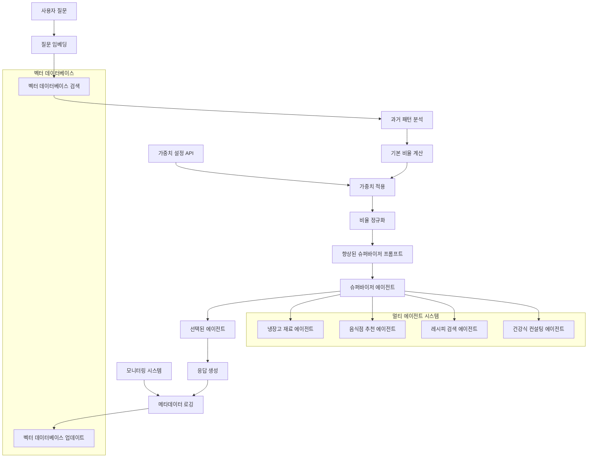

# 가중치 기반 프롬프트 멀티 에이전트 라우터

[](https://opensource.org/licenses/MIT)
[](https://github.com/dongju2-lee/weighted-prompt-multi-agent-router)
[](https://github.com/dongju2-lee/weighted-prompt-multi-agent-router)

> **🚀 공지사항:** 실제 테스트 기반 결과 및 성능 벤치마크를 곧 공개할 예정입니다!  
> **📅 연구 공개일:** 2025년 6월 26일  
> **👨‍💻 주요 연구자:** [@dongju2-lee](https://github.com/dongju2-lee)  
> **🔬 연구 현황:** 진행 중 - 테스트 결과 및 구현 내용이 지속적으로 업데이트됩니다

[한국어 README](./README_KOR.md) | [English README](./README.md)

## 🎯 개요

가중치 기반 프롬프트 멀티 에이전트 라우터는 **데이터 기반 라우팅 비율을 프롬프트에 직접 주입하여 슈퍼바이저 에이전트의 라우팅 결정을 돕는** 혁신적인 시스템입니다. 

기존 멀티 에이전트 시스템은 슈퍼바이저에 모든 에이전트의 상세한 역할 설명을 프롬프트에 포함해야 했다면, 우리 시스템은 과거 라우팅 데이터에서 추출한 통계적 비율과 간단한 에이전트별 역할을 프롬프트에 제공합니다. 이를 통해 토큰 사용량을 획기적으로 줄이면서도 데이터 기반의 정확한 라우팅이 가능합니다. 더 나아가 가중치 파라미터를 조정하는 것만으로도 실시간 A/B 테스트, 새로운 에이전트 도입, deprecated 에이전트 제거 등을 시스템 재시작 없이 즉시 반영할 수 있어 프로덕션 환경에서의 운영 유연성을 극대화합니다. 특히 100개 이상의 대규모 멀티 에이전트 환경에서 그 효과가 극명하게 드러납니다.

**핵심 혁신:**
- 📊 **데이터 기반 비율 계산**: 벡터 데이터베이스의 과거 라우팅 패턴에서 에이전트별 라우팅 비율을 추출
- 🎯 **프롬프트 강화**: 계산된 비율을 슈퍼바이저 에이전트 프롬프트에 직접 삽입하여 라우팅 힌트 제공
- ⚡ **즉각적 제어**: 가중치 조정만으로 실시간 라우팅 비율 변경 및 즉각적인 시스템 동작 제어 가능

이 접근 방식을 통해 대규모 멀티 에이전트 시스템에서도 토큰 효율성을 유지하면서 정확한 라우팅과 유연한 제어가 가능합니다.

## 💡 연구 동기

### 기존 멀티 에이전트 라우팅의 문제점

기존 멀티 에이전트 시스템은 규모가 커질수록 다음과 같은 심각한 문제들에 직면합니다:

1. **토큰 비효율성**: 100개 이상의 에이전트를 가진 시스템은 모든 에이전트 설명을 포함한 거대한 프롬프트가 필요
2. **비용 폭증**: 대규모 시스템에서 잘못된 에이전트 선택은 상당한 계산 비용 낭비로 이어짐
3. **제한적인 A/B 테스트**: 실시간 에이전트 배포를 위해서는 시스템 재시작과 프롬프트 수정이 필요
4. **에이전트 제거의 어려움**: 프로덕션에서 에이전트를 제거하려면 복잡한 시스템 변경이 필요

### 우리의 해결책

가중치 기반 프롬프트 멀티 에이전트 라우터는 다음과 같은 방법으로 이러한 문제들을 해결합니다:
- 포괄적인 에이전트 설명 대신 과거 라우팅 패턴 활용
- 가중치 조정을 통한 실시간 A/B 테스트 지원
- 트래픽 점진적 감소를 통한 부드러운 에이전트 deprecation
- 낮은 성능의 LLM 모델에서도 효과적으로 작동

## 🏗️ 시스템 아키텍처



## 🔄 시스템 플로우

### 1. 과거 패턴 분석
```python
def get_routing_recommendation(user_query, similarity_threshold=0.7):
    # 질문을 벡터 공간으로 임베딩
    query_embedding = embed_query(user_query)
    
    # 유사한 과거 질문들 검색
    similar_traces = vector_db.similarity_search(
        query_embedding, 
        top_k=100,
        threshold=similarity_threshold
    )
    
    # 에이전트별 라우팅 비율 계산
    agent_counts = {}
    total_traces = len(similar_traces)
    
    for trace in similar_traces:
        agent = trace['routed_agent']
        agent_counts[agent] = agent_counts.get(agent, 0) + 1
    
    base_ratios = {
        agent: count / total_traces 
        for agent, count in agent_counts.items()
    }
    
    return base_ratios, total_traces
```

### 2. 가중치 적용 및 정규화
```python
def apply_weights_and_normalize(base_ratios, agent_weights):
    # 사용자 정의 가중치 적용
    weighted_ratios = {}
    for agent, ratio in base_ratios.items():
        weight = agent_weights.get(agent, 1.0)
        weighted_ratios[agent] = ratio * weight
    
    # 100%로 재정규화
    total_weighted = sum(weighted_ratios.values())
    
    if total_weighted > 0:
        normalized_ratios = {
            agent: (ratio / total_weighted) * 100
            for agent, ratio in weighted_ratios.items()
        }
    else:
        normalized_ratios = {}
    
    return normalized_ratios
```

### 3. 향상된 슈퍼바이저 프롬프트 생성
```python
def generate_supervisor_prompt(user_query, normalized_ratios, total_traces):
    historical_context = f"""
과거 데이터 분석 결과:
- 총 {total_traces}개의 유사한 질문 데이터를 참고했습니다.
- 과거 라우팅 패턴:
"""
    
    for agent, percentage in normalized_ratios.items():
        historical_context += f"  • {agent}: {percentage:.1f}%\n"
    
    supervisor_prompt = f"""
사용자 질문: "{user_query}"

{historical_context}

위의 히스토리컬 데이터를 참고하여 가장 적절한 에이전트를 선택하세요.
과거 패턴을 고려하되, 현재 질문의 구체적인 맥락도 함께 분석하여 최종 결정을 내려주세요.

사용 가능한 에이전트:
- 냉장고 재료 에이전트: 집에 있는 재료로 요리 추천
- 음식점 추천 에이전트: 외식 장소 추천
- 레시피 검색 에이전트: 상세한 요리법 제공
- 건강식 컨설팅 에이전트: 건강 목적 음식 추천

선택된 에이전트와 선택 이유를 설명해주세요.
"""
    
    return supervisor_prompt
```

## 📊 메타데이터 구조

과거 라우팅 데이터는 다음과 같은 형식으로 저장됩니다:

```json
{
  "trace_id": "trace_12345",
  "timestamp": "2025-06-26T03:02:00Z",
  "user_query": "음식 추천해줘",
  "query_embedding": [0.1, 0.2, ...],
  "routed_agent": "냉장고_재료_에이전트",
  "agent_confidence": 0.85,
  "routing_weights": {
    "냉장고_재료_에이전트": 0.85,
    "음식점_추천_에이전트": 0.12,
    "레시피_검색_에이전트": 0.03
  },
  "response": "냉장고에 있는 계란과 양파로 오믈렛을 만들어보세요",
  "response_embedding": [0.3, 0.4, ...],
  "execution_time": 1.2,
  "user_feedback": null,
  "session_id": "session_abc123"
}
```

## 🎛️ 활용 사례

### 1. 대규모 에이전트 관리
- **문제**: 200개 이상의 에이전트로 인한 거대한 프롬프트 필요
- **해결책**: 과거 패턴을 통해 포괄적인 에이전트 설명 불필요

### 2. 실시간 A/B 테스트
```python
# 예시: 새로운 에이전트에 5% 트래픽 테스트
agent_weights = {
    "새로운_실험_에이전트": 1.0,
    "기존_에이전트_a": 0.95,
    "기존_에이전트_b": 0.95
}
```

### 3. 부드러운 에이전트 deprecation
```python
# 예시: deprecated 에이전트 트래픽 점진적 감소
agent_weights = {
    "deprecated_에이전트": 0.2,    # 과거 트래픽의 20%로 감소
    "대체_에이전트": 1.2           # 대체 에이전트 증가
}
```

## 🔬 연구팀

- **주요 연구자**: [@dongju2-lee](https://github.com/dongju2-lee)
- **기여자들**: *[연구 협력자가 참여하는 대로 업데이트 예정]*

## 📈 모니터링 및 분석

시스템은 LangGraph Studio 및 LangFuse와 같은 모니터링 솔루션과 통합하여 다음을 제공합니다:
- 라우팅 성능 메트릭 수집
- 에이전트 효과성 분석
- 사용자 만족도 추적
- 가중치 최적화를 위한 인사이트 생성

## 🌟 핵심 장점

### 1. 비용 효율성
- **문제 해결**: 대규모 멀티 에이전트 시스템에서 잘못된 에이전트 선택으로 인한 비용 낭비
- **해결 방법**: 과거 패턴을 통한 정확도 향상으로 비용 최적화

### 2. 유연한 트래픽 제어
- **A/B 테스트**: 실시간으로 새로운 에이전트에 트래픽 분배
- **점진적 배포**: 새로운 에이전트를 안전하게 프로덕션에 도입
- **트래픽 조절**: deprecated 에이전트의 트래픽을 점진적으로 감소

### 3. 확장성
- **토큰 효율성**: 에이전트 수가 증가해도 프롬프트 크기가 급격히 증가하지 않음
- **성능 유지**: 낮은 성능의 LLM 모델에서도 효과적으로 작동

## 🚀 시작하기

*[시스템 개발이 진행됨에 따라 구현 세부사항 및 설정 지침이 추가될 예정]*

## 📋 로드맵

- [ ] 핵심 시스템 구현
- [ ] 벡터 데이터베이스 통합
- [ ] 가중치 관리 API
- [ ] 모니터링 대시보드
- [ ] 성능 벤치마크
- [ ] 프로덕션 배포 가이드

## 💭 실제 적용 시나리오

### 음식 추천 멀티 에이전트 시스템 예시

다음과 같은 4개의 에이전트가 있는 시스템을 가정해봅시다:

1. **냉장고 재료 기반 요리 추천 에이전트** - 냉장고에 있는 재료를 분석해서 만들 수 있는 요리를 추천
2. **음식점 추천 에이전트** - 사용자의 위치와 선호도를 바탕으로 적합한 음식점을 추천
3. **레시피 검색 에이전트** - 특정 음식이나 요리법에 대한 상세한 레시피를 제공
4. **건강식 컨설팅 에이전트** - 사용자의 건강 상태나 다이어트 목표에 맞는 음식을 추천

#### 애매한 라우팅 시나리오들

다음과 같은 질문들이 여러 에이전트로 라우팅될 수 있습니다:

- **"음식 추천해줘"** → 냉장고 에이전트(집에서 만들기), 음식점 에이전트(외식), 건강식 에이전트(건강 고려)로 모두 라우팅 가능
- **"다이어트 음식 뭐가 좋을까?"** → 건강식 에이전트(다이어트 전문), 냉장고 에이전트(집에서 만들기), 레시피 에이전트(저칼로리 요리법)로 분산 가능
- **"오늘 저녁 뭐 먹지?"** → 4개 에이전트 모두 관련성이 있어서 완전히 랜덤하게 라우팅될 수 있음
- **"파스타 관련해서 도움줘"** → 레시피 에이전트(만드는 법), 음식점 에이전트(파스타 맛집), 냉장고 에이전트(집에 있는 재료로)로 애매함

### 시스템의 해결 방법

우리 시스템은 이런 애매한 상황에서도 다음과 같이 동작합니다:

1. **과거 패턴 분석**: "다이어트 음식 뭐가 좋을까?"와 유사한 질문들을 벡터 검색
2. **비율 계산**: 과거 유사 질문들이 어떤 에이전트로 라우팅되었는지 비율 계산
3. **가중치 적용**: 개발자가 설정한 가중치를 적용하여 비율 조정
4. **슈퍼바이저 지원**: 계산된 비율을 참고 정보로 제공하여 더 정확한 라우팅 결정 도움

## 📄 라이선스

이 프로젝트는 MIT 라이선스 하에 있습니다. 자세한 내용은 [LICENSE](LICENSE) 파일을 참조하세요.

## 🤝 기여하기

이 연구 프로젝트에 대한 기여를 환영합니다. 행동 강령과 풀 리퀘스트 제출 과정에 대한 자세한 내용은 [CONTRIBUTING.md](CONTRIBUTING.md)를 읽어주세요.

## 📧 연락처

이 연구에 대한 질문이 있으시면 [@dongju2-lee](https://github.com/dongju2-lee)에게 연락하거나 이 저장소에 이슈를 열어주세요.

---
*2025년 6월 26일 연구 시작* 